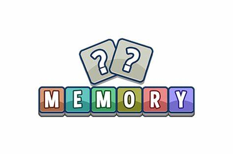
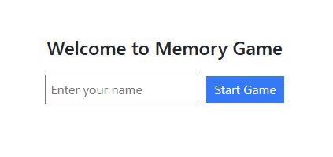
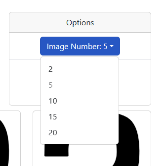
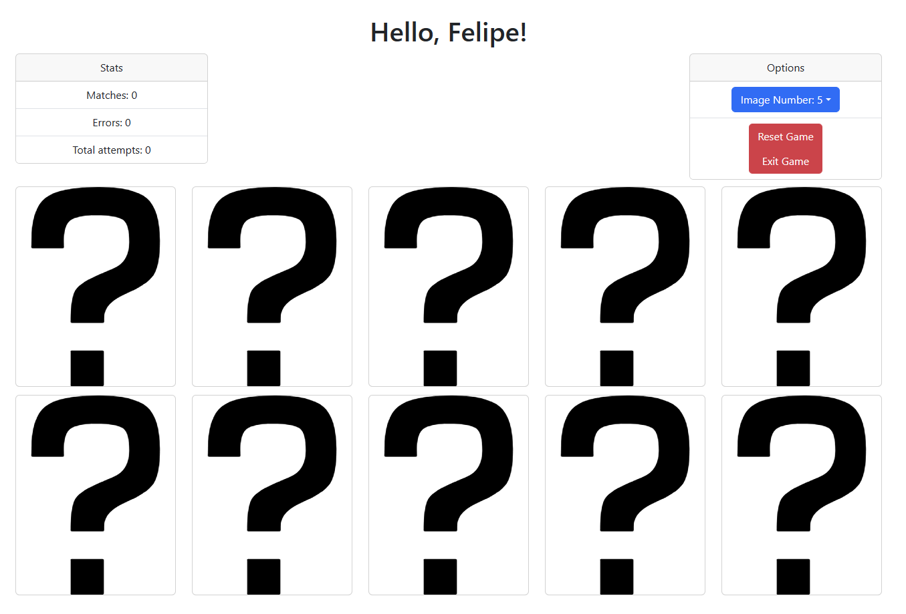

# Memory Game (Memorize) in React

This is a simple Memory Game (Memorize) built in React using Create React App. The game involves matching cards and can be configured to display various options (number of cards).

## Features

- **Memory Game**: Find all card pairs in the fewest number of attempts possible.
- **Options Configuration**: You can customize the number of options for the game.
- **Attempt Tracking**: The game records the total number of attempts, successes, and errors.
- **Game Reset**: You can reset the game at any time.
- **Game Exit**: You can exit the game at any time.

## How to Start the Game

1. Open the application in your browser.
2. Enter your name to get started.
3. Adjust the number of options according to your preferences.
4. Click "Start Game" to begin playing.
5. Find all card pairs.

## Options API

The game options are retrieved from the following API:
GET: https://fed-team.modyo.cloud/api/content/spaces/animals/types/game/entries?per_page=20

Make sure you have an active internet connection to load the options.

## Technologies Used

- React
- Create React App
- Bootstrap (for styles)
- Axios (for making API requests)

## Local Execution

1. Clone this repository:

git clone https://github.com/FelipeAGG/memory-game.git

2. Navigate to the project directory:

cd /memory-game

3. Install the dependencies:

npm install

4. Start the application:

npm start

5. Open your browser and visit `http://localhost:3000` to play.

## Customization

You can customize the game and add new features as needed. Feel free to explore the source code and make any modifications you desire.

## Credits

This game was created by Felipe Gallardo.

## License

This project is under the MIT License. See the [LICENSE](LICENSE) file for more details.
